## Terraform AWS VPC + EC2 + RDS (MySQL) Project

### This project demonstrates how I designed and deployed a modular, multi-tier AWS infrastructure using Terraform. The setup follows cloud networking and security best practices by separating public-facing resources from internal services, while keeping sensitive data out of source control.

### Architecture Overview:


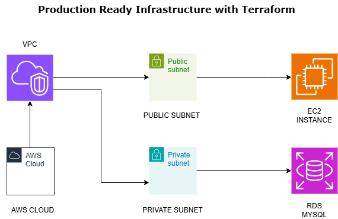


                          +------------------------+
                          |      AWS Region        |
                          +------------------------+
                                     |
                             +--------------+
                             |     VPC      |  10.0.0.0/16
                             +--------------+
                             |              |
                    +--------+-------+   +-----------+--------+
                    | Public Subnet  |   |   Private Subnet   |
                    | 10.0.1.0/24    |   |   10.0.2.0/24      |
                    +--------+-------+   +-----------+--------+
                             |                       |
                      +------------+       +---------------+
                      |  EC2 (Web) |       |  RDS (MySQL)  |
                      +------------+       +---------------+
                         (public)              (private)


The architecture uses:

- A custom VPC with public and private subnets

- A public EC2 instance that acts as a web host / bastion

- A private RDS MySQL database that is never exposed to the internet

- Terraform modules to keep the code clean, reusable, and easy to scale

- AWS SSM Parameter Store for secure secret management

- State locking with S3 and DynamoDB

### Why Terraform Modules

Instead of writing everything in a single Terraform file, I split the infrastructure into three logical modules:

- vpc – Networking (VPC, subnets, route tables, internet gateway, RDS security group)

- ec2 – Compute (public EC2 instance and SSH security group)

- rds – Database (RDS instance and DB subnet group)

### Benefits

- Code is reusable across environments

- Infrastructure is easier to maintain and debug

- Each component is logically isolated

- The root module only focuses on wiring things together


### Project Folder Structure:

```
terraform-vpc-ec2-rds-setup/
├── main.tf
├── backend.tf
├── variables.tf
├── outputs.tf
├── providers.tf
├── terraform.tfvars (goes in .gitignore)
└── modules/
├── vpc/
│ ├── main.tf
│ ├── variables.tf
│ └── outputs.tf
├── ec2/
│ ├── main.tf
│ ├── variables.tf
│ └── outputs.tf
└── rds/
├── main.tf
├── variables.tf
└── outputs.tf

```

### Pre-requisites:

Before running terraform apply, make sure the following setup is completed.

1. Create EC2 Instance (Ubuntu 24.04 - t2.micro). Login via ssh and run the script to Install Terraform and AWS CLI V2 

```
sudo chmod +x install-tf-and-aws-cli2.sh
./ install-tf-and-aws-cli2.sh
```

2. AWS CLI Configuration

This project uses AWS CLI authentication via access keys.

Configure AWS credentials locally:

```
aws configure
```

Provide:

```
AWS Access Key ID

AWS Secret Access Key
```
The configured IAM user must have permissions to create VPC, EC2, RDS, SSM parameters, S3 backend resources, and DynamoDB (if used for locking).

3. SSH Key Pair (EC2 Access)

An SSH key pair is required to access the EC2 instance.

Generate a key locally:

```
ssh-keygen -t rsa -b 4096 -f ~/.ssh/ritika-ec2-key
```
Terraform registers the public key in AWS

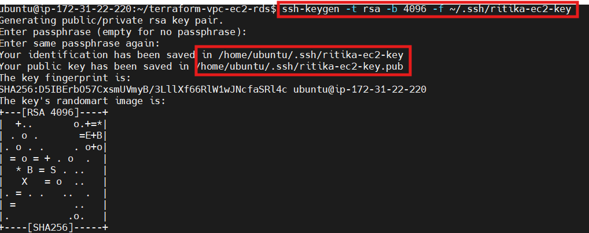

4. SSM Parameter for RDS Password

The RDS password is stored securely in AWS Systems Manager Parameter Store.

Create it before running terraform init:

```
aws ssm put-parameter \
  --name "/prod/rds/db_password" \
  --value "your-secure-password" \
  --type "SecureString"
```
Terraform retrieves it dynamically during deployment.

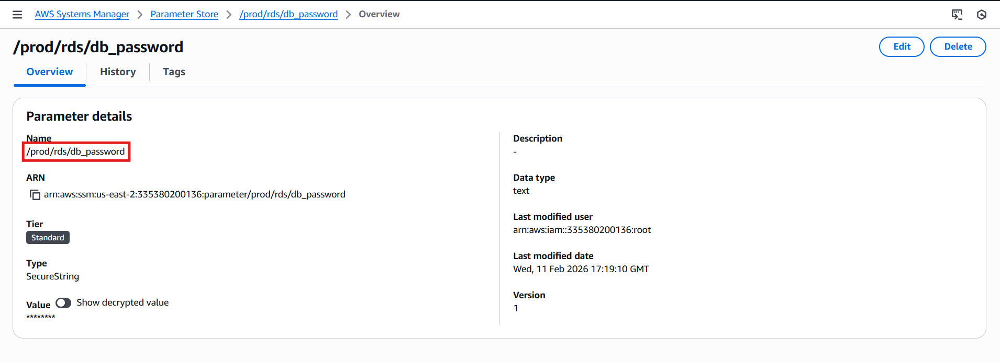

4. Create an S3 Bucket + DynamoDB Table for Terraform Backend

Using a remote backend is crucial for collaborative, consistent, and recoverable infrastructure. It stores your Terraform state file securely and handles locking to avoid simultaneous changes.

Create the S3 bucket and DynamoDB table before terraform init.

Example:

```
aws s3api create-bucket \
  --bucket terraform-state-bucket-120226 \
  --region us-east-2 \
  --create-bucket-configuration LocationConstraint=us-east-2

```
Note: S3 requires a LocationConstraint parameter for regions other than us-east-1. Without it, the API throws IllegalLocationConstraintException.


```
aws dynamodb create-table \
  --table-name terraform-locks \
  --attribute-definitions AttributeName=LockID,AttributeType=S \
  --key-schema AttributeName=LockID,KeyType=HASH \
  --billing-mode PAY_PER_REQUEST \
  --region us-east-2
```


### Terraform Deployment Steps

1. Initialize

```
terraform init
```

2. Review Plan

```
terraform plan
```
3. Apply

```
terraform apply -auto-approve
```

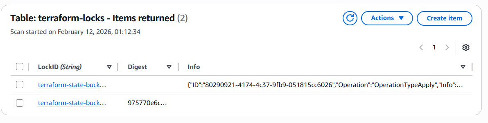

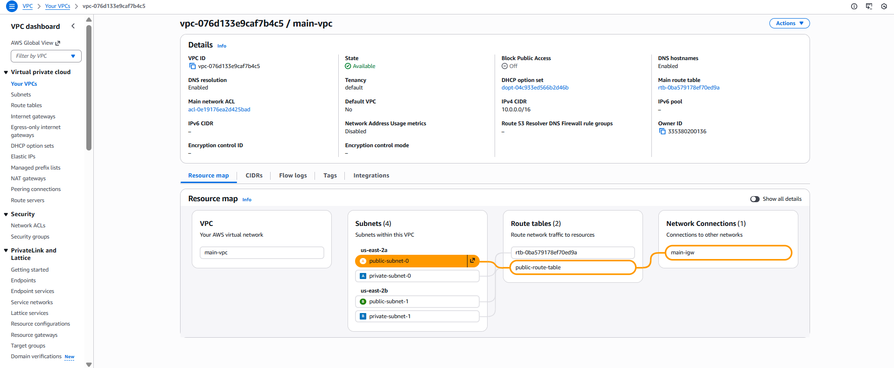

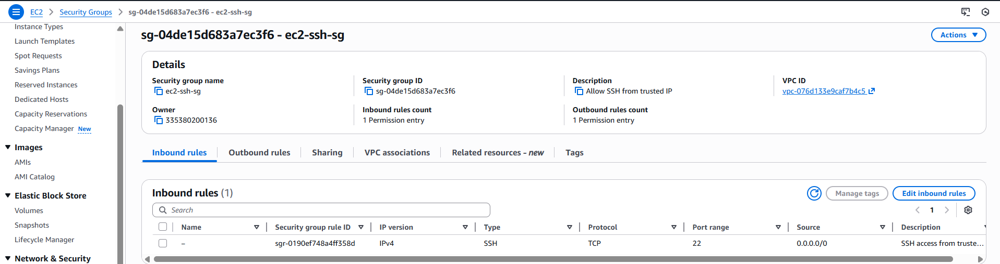

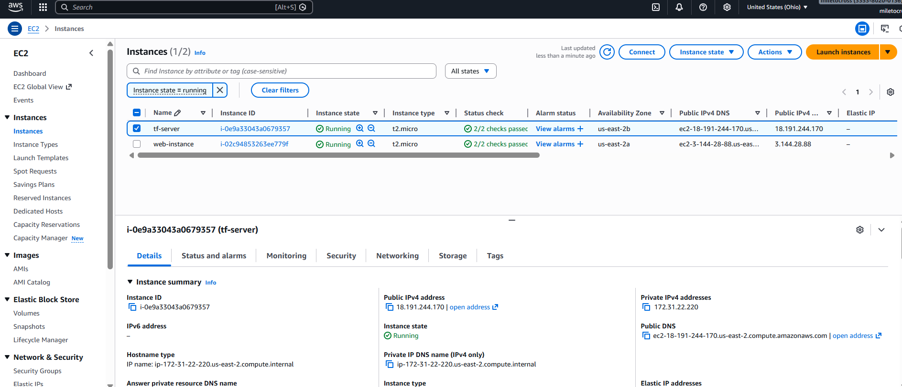

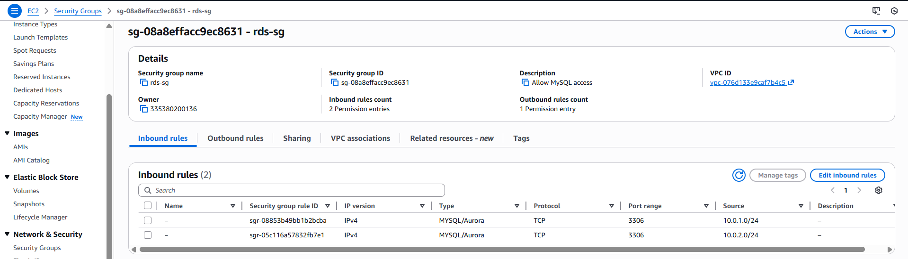

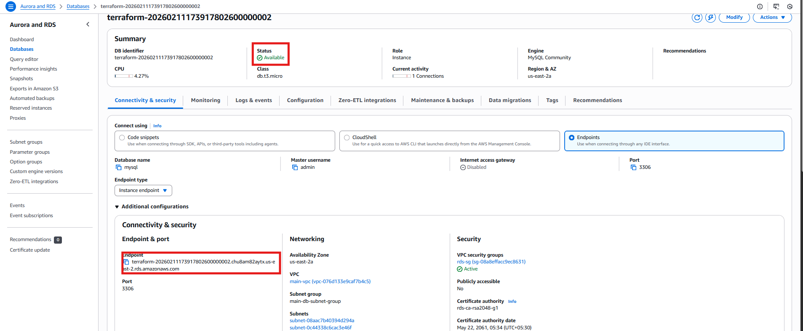

### Validation & Testing

SSH into Created EC2:

```
sudo chmod 400 ~/.ssh/ritika-ec2-key
ssh -i ~/.ssh/ritika-ec2-key ubuntu@<EC2-PUBLIC-IP>
```

Verify MySQL Client Installation:

```
cat /home/ec2-user/mysql-installed.log
which mysql
mysql --version
```

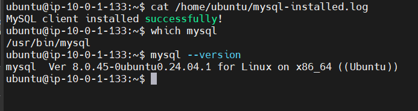

Connect to RDS

```
mysql -h <rds_endpoint> -u admin -p
```
Enter the db password you stored in SSM when prompted. If you see the MySQL CLI, you’re in!

Then you’ll get the mysql> prompt, run below commands:

```
mysql>
```

Database Test:

```
SHOW DATABASES;

CREATE DATABASE testdb;
USE testdb;

CREATE TABLE hello (
id INT PRIMARY KEY,
message VARCHAR(100)
);

INSERT INTO hello VALUES (1, 'Hello from Terraform RDS!');
SELECT * FROM hello;
exit
```

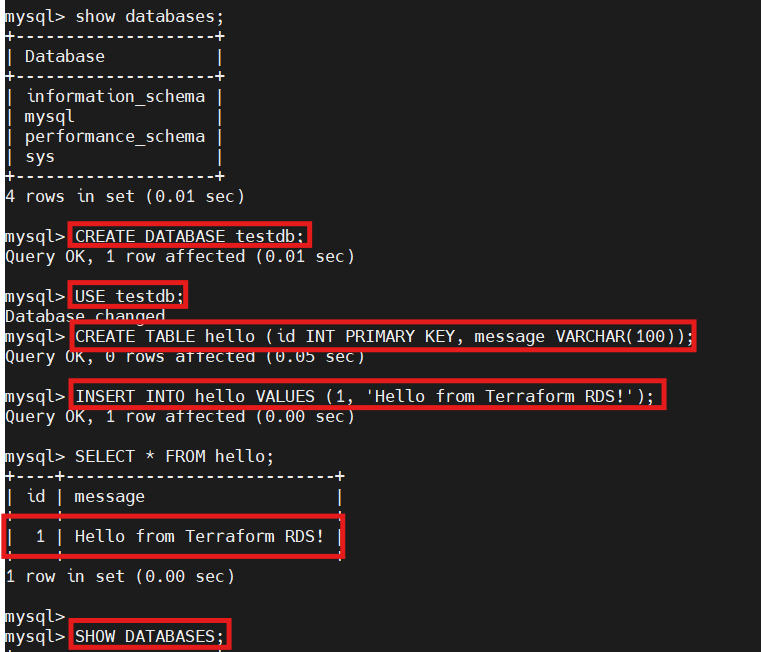

Clean Up:

To avoid AWS charges, I destroy the infrastructure after testing:

```
terraform destroy -auto-approve
```


Good to Know:

| Thing        | Managed By   | Stored Where       |
| ------------ | ------------ | -------------------|
| SSH Key Pair | Terraform    | AWS                |
| Private Key  | You          | Local machine      |
| DB Password  | SSM / tfvars | AWS / Local        |


#### Easy way understand the project:

Laptop 
  |
Internet
  |
IGW
  |
EC2 (Public Subnet, SSH 22 from My IP)
  |
MySQL 3306 (Private Network)
  |
RDS (Private Subnet, No Public Access)